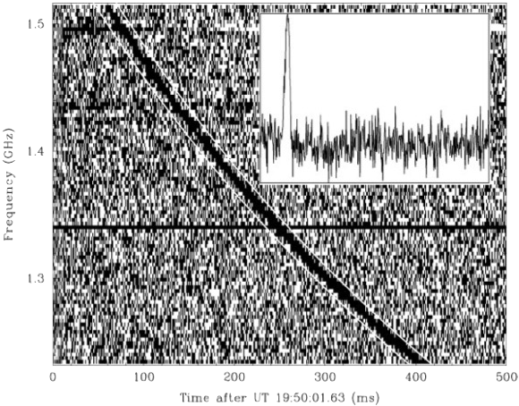

The AstroFlash project constitutes the most precise studies on the localizations of Fast Radio Bursts (FRBs).

---

One section

---

### Localizing Fast Radio Bursts

A **Fast Radio Burst** (FRBs) is a bright flash of light that only last for a few milliseconds. FRBs have only been detected at radio wavelengths, and they are produced at cosmological distances.

---

