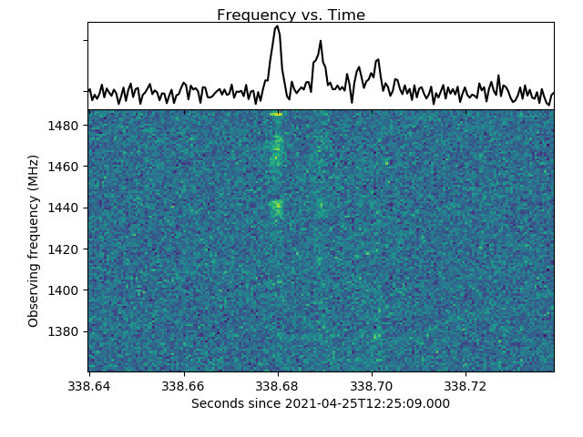

Title: Plots for ATel #14605
Date: 2021-05-06
Category: ATel

Dedispersed dynamic spectra and frequency averaged time series of two bursts from FRB 20201124A detected with the Onsala 25m telescope at 1.4 GHz. The data were dedispersed using DM=410 pc cm^-3 and are plotted at time and frequency resolution of 512 us and 1 MHz. No bursts were detected during contemporaneous observations with the Westerbork RT1 telescope at 330 MHz. The bursts are discussed in more detail in [Kirsten et al. 2021, ATel #14605)](https://www.astronomerstelegram.org/?read=14605).
